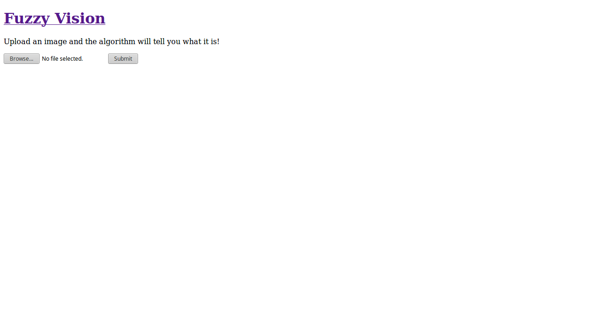
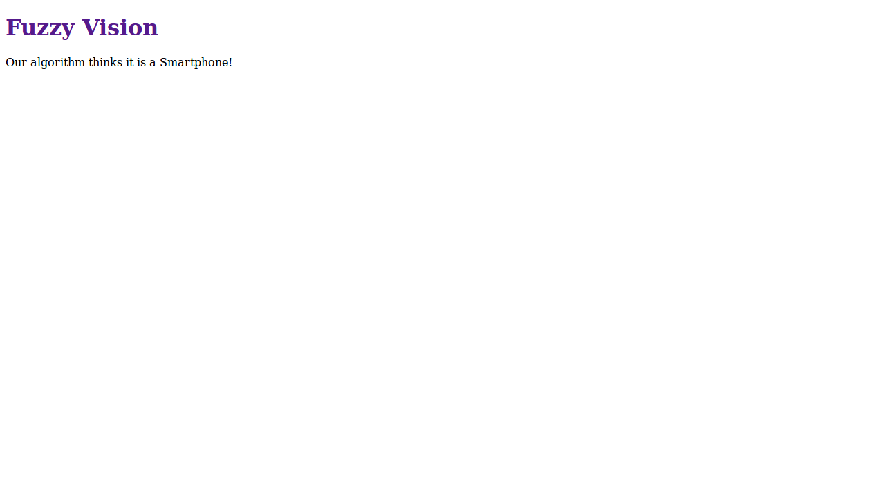
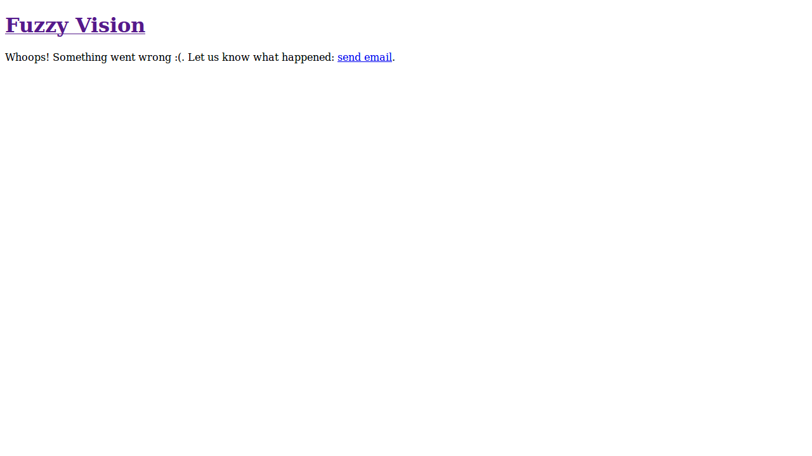
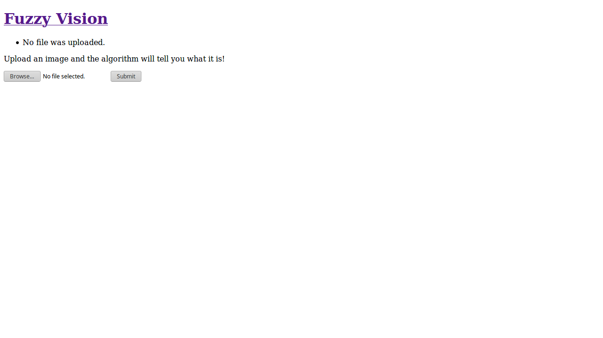
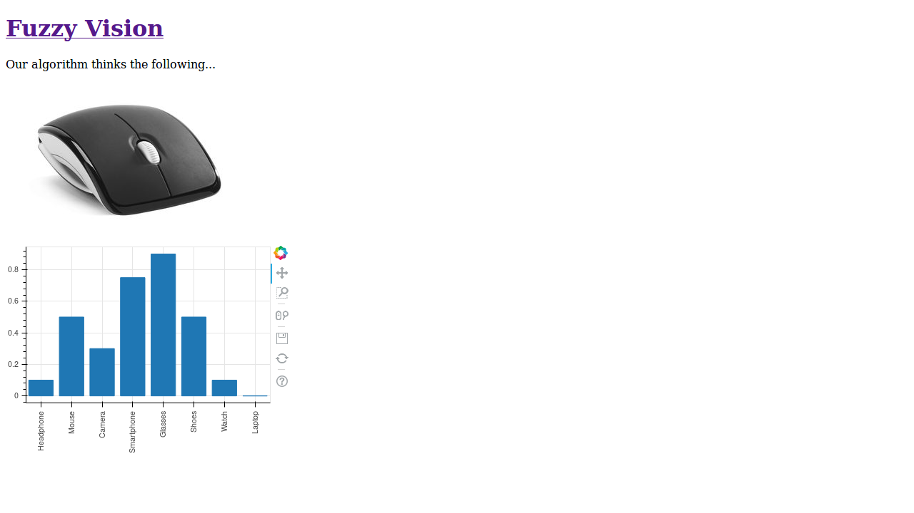
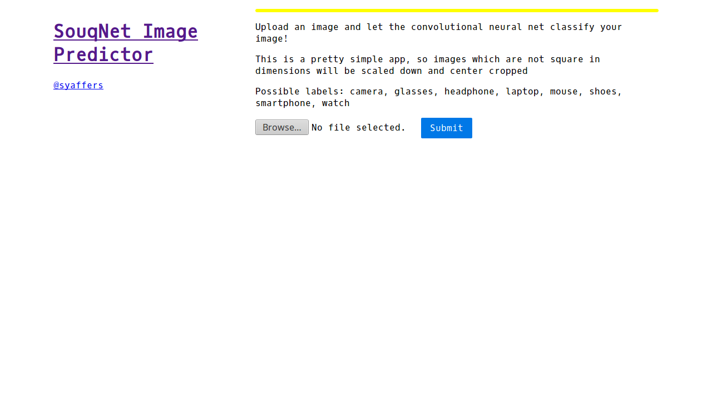
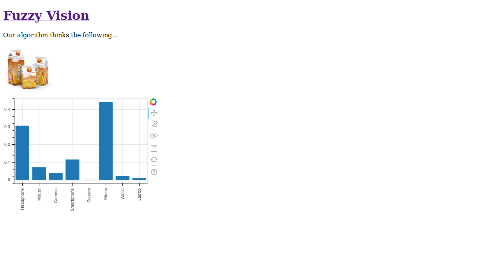

# Quick Image Classifier Web Application with Flask, Keras and Bokeh

## Learning Outcomes

- Learn how to quickly build "microservices" in Flask.
- Draw and plot beautiful, web-friendly barcharts with Bokeh.
- Load up pre-trained image classification models using Keras.

## Prerequisites

- Ubuntu/Debian-flavored Linux
- Your best Python chops! You will also need `pip` along with it.
- `virtualenv` will help a lot as you need lots of custom packages.
- Played around with Keras. We won't be training a model, just using one.

## Motivation

You have just built an awesome convolutional neural network which takes images
and spits out what the object in the image is (to some degree of certainty).
You want to share it with your peers around the world to get some feedback on
how well it is performing while, at the same time, collect training data to
train your model more. While it can be tempting to create a desktop
application, this does not distribute easily. An easy way forward is to create
a quick interface on the internet and share it to your friends.

What? You don't have a model trained already? It's okay, we can use a model I
trained to classify images from an online marketplace into 8 different labels.

## Setting Up your Workspace

Let's begin by making a virtual environment in Python. I will be using Python
2.7 but feel free to use Python 3.5 if you are more familiar. The code is
mainly version-agnostic. In your terminal:

    # Terminal window

    $ mkdir ~/venvs/
    $ virtualenv ~/venvs/fuzzvis
    ... # some output messages
    $ source ~/venvs/fuzzvis/bin/activate
    (fuzzvis) $ which pip
    /home/syafiq/venvs/bin/pip

If you see something similar in your terminal window, you are on the right
track. If not, you might want to install `python-virtualenv`.

Let's also make a project folder to keep all the code in one place. I'm going
to call it Fuzzy Vision, for lack of a better name. In your terminal:

    # Terminal window

    (fuzzvis) $ mkdir ~/fuzzy-vision
    (fuzzvis) $ cd ~/fuzzy-vision

We will need a project structure as follows, you will need to create those
files and folders yourselves:

    ~/fuzzy-vision/
    |-- server.py
    |-- static
    |   `-- styles
    |       `-- app.css
    `-- templates
        |-- error.html
        |-- home.html
        |-- layout.html
        `-- predict.html

## The Basic Requirements

The web interface is going to need some basic requirements. Let's list a few
to start. We will update this as we go along, if we need to.

### Requirements List

#### Interface
1. [ ] Image upload `<form>` page
2. [ ] Results page
3. [ ] Error page

#### Functionality
1. [ ] Upload and store image
2. [ ] Serve uploaded image
3. [ ] Predict uploaded image into 8 labels
4. [ ] Display predictions of image in a chart
5. [ ] Redirect errors to the error page

Okay, that's pretty basic. Let's run with it for now.

---

## Microservices with Flask

Flask is a Python microservice framework to build web applications quickly.
It has minimal setup and is akin to Express in NodeJS with (more than) several
things missing. Doesn't mean it's a bad framework, as we will see shortly!

Let's begin by installing Flask into your virtual environment. In your
terminal:

    # Terminal window

    (fuzzvis) $ pip install Flask==0.12.2
    ... # some output messages

### The Flask "Hello, world!"

We will start with a basic *Hello, World!* application. It's as easy as

    # server.py

    from flask import Flask

    app = Flask(__name__)

    @app.route('/', methods=['GET'])
    def home():
        return "Hello, internet!"

That's it, you're good to go! Flask has some quirky ways to run the web app.
One way is to define in your terminal an environment variable called
`FLASK_APP` and point it to `server.py`. Another way is to have a run block
in `server.py` and just call `python server.py` in your terminal. Just to not
have to do weird things to your computer, let's go with option 2. Add the
following to the bottom of `server.py`.

    # server.py

    ...

    if __name__ == "__main__":
        app.run('127.0.0.1')

Run it with

    # Terminal window

    (fuzzvis) $ python test.py
    * Running on http://127.0.0.1:5000/ (Press CTRL+C to quit)

If you point your browser to the URL, you should see "Hello, internet!"
displayed, in all it's empty, blank glory. Flask runs on port 5000 by defult.
You can change this by adding an extra parameter to `app.run()`. __Note: Flask
requires a restart of the app every time you make updates to the server code
or HTML. If you find that your changes are not appearing, try restarting the
web application.__

### Adding Routes to your App

Let's mock up some routes. We'll need 3:
1. the home page, where the image upload form will be,
2. the results page, where we will show the uploaded image and the predictions,
3. the error page, because things can (and will) go wrong.

In Flask, we use the decorator `app.route()` and pass the route string and
the available methods for that route. For this app, we will `POST` to the home
page route so that any errors for the uploaded image will be displayed and the
user will be returned to the upload form. If everything goes well, we will
redirect the users to the results page where we will perform the prediction
on the uploaded image.

The other pages' routes are just `GET` routes.

Also we will need a HTML page to be rendered. Luckily, Flask has us covered
with its `render_template()` function. We will create the templates later. In
code:

    # server.py

    from flask import Flask, render_template, request, redirect, url_for

    app = Flask(__name__)

    @app.route('/', methods=['GET', 'POST'])
    def home():
        if request.method == 'GET':
            # show the upload form
            return render_template('home.html')

        if request.method == 'POST':
            # TODO: Logic to process uploaded images

            passed = True # for now
            if passed:
                return redirect(url_for('predict', filename='test.png')) # for now
            else:
                return redirect(url_for('error'))

    @app.route('/predict/<filename>', methods=['GET'])
    def predict(filename):
        # TODO: Logic to load the uploaded image filename and predict the
        # labels

        return render_template('predict.html')

    @app.errorhandler(500)
    def server_error(error):
        return render_template('error.html'), 500

    ...

Notice that the prediction route has a string between `<>` brackets. This is
to inform the route that it must have a `filename` entered in the URL. So
passing `/predict/` to your browser will render a 404 error. But `/predict/abc`
will pass.

## Templating the Pages

Flask's templating engine is very easy to use too. You can create HTML layouts
with lots of __blocks__ which will encapsulate the inner page contents. We will
use this for all of our 3 pages. First, we define a basic layout, reducing the
need to copy and paste headers and footers into each page template.

    # templates/layout.html

    <!DOCTYPE html>
    <html lang="en">
    <head>
        <meta http-equiv="Content-Type" content="text/html;charset=UTF-8">
        <title>Fuzzy Vision | Upload and Predict Images</title>
    </head>
    <body>
        <h1><a href='/'>Fuzzy Vision</a></h1>
        
    </body>
    </html>

Next, we define our home page, with a `<form>` tag to store the image upload
HTML element.

    # templates/home.html

    
    
    
Upload an image and the algorithm will tell you what it is!

    <form action="/" method="post" enctype="multipart/form-data">
        <input type="file" name="image" id="image">
        <input type="submit" value="Submit">
    </form>
    

Notice the use of the `` tag at the beginning of the
file. This is to tell Flask that we are inheriting a parent HTML file called
`layout.html` and replacing the `` tags with
the HTML we defined in the `templates/home.html` file.

The `<form>` is also coded to have the `enctype="multipart/form-data"`
attribute. This is necessary for image uploading as files are passed as a
separate `POST` variable.

The filename does not have to match the route names in our `server.py`. Let's
create the remaining templates. We will just have placeholder text for now
until we code the actual logic of the predictions. !!! ASIDE !!!

The results page:

    # templates/predict.html

    
    
    
Our algorithm thinks it is a Smartphone!

    

The error page:

    # templates/error.html

    
    
    

        Whoops! Something went wrong :(. Let us know what happened:
        <a href="mailto:admin@example.com">send email</a>.
    

    

Notice how the `h1` link with "Fuzzy Vision" persists over all the pages
without us explicitly coding it into the templates. The templating engine can
do much more but for now, this is good enough.

---

## Adding the Image Upload Functionality

Let's review our requirements.

### Requirements List

#### Interface
1. [x] Image upload `<form>` page
2. [x] Results page
3. [x] Error page

#### Functionality
1. [ ] Upload and store image
2. [ ] Serve uploaded image
3. [ ] Predict uploaded image into 8 labels
4. [ ] Display predictions of image in a chart
5. [x] Redirect errors to the error page

We should now be ready to start adding key functionality to the web
application. Let's start with the image uploading and storage functionality.
For the sake of ease, we will use a typical filesystem storage. When images are
uploaded, it just gets stored in a folder somewhere on the server (or computer)
hosting the web application. Straight to the code!

    # server.py

    import os
    from flask import Flask, flash, render_template, redirect, request, url_for

    app = Flask(__name__)
    app.config['SECRET_KEY'] = "supertopsecretprivatekey"

    @app.route('/', methods=['GET', 'POST'])
    def home():
        if request.method == 'GET':
            # show the upload form
            return render_template('home.html')

        if request.method == 'POST':
            # check if a file was passed into the POST request
            if 'image' not in request.files:
                flash('No file was uploaded.')
                return redirect(request.url)

            image_file = request.files['image']

            # if filename is empty, then assume no upload
            if image_file.filename == '':
                flash('No file was uploaded.')
                return redirect(request.url)

            # if the file is "legit"
            if image_file:
                passed = False
                try:
                    filename = image_file.filename
                    filepath = os.path.join('/tmp/fuzzvis/', filename)
                    image_file.save(filepath)
                    passed = True
                except Exception:
                    passed = False

                if passed:
                    return redirect(url_for('predict', filename=filename))
                else:
                    flash('An error occurred, try again.')
                    return redirect(request.url)

    ...

In the updated code, we now have a more meaty `POST` request home route. We
first check if there was an image uploaded at all. If there isn't any, we
redirect the user back to the upload page. Otherwise, we save the the image
into a temporary directory in Linux: `/tmp/fuzzvis/`. If any error occurs
during the upload, just send the users back to the homepage.

We also added a Flask configuration `SECRET_KEY` variable. This is needed as
passing files into a `POST` request generates a new session. For security,
will require a secret key to be defined. This value has to be unique and
ideally hard to guess. For now, we will use a string of characters. We will
also need to create the upload directory for the code to work:

    # Terminal window

    (fuzzvis) $ mkdir -p /tmp/fuzzvis/

Notice that before the redirects, we use a `flash()` function. This comes from
the Flask API and allows us to generate messages that are rendered once, as
error messages are often displayed. We will need to update our templates for
this to work properly. Since this only happens in the home page, we just need
to update the home template.

    # templates/home.html

    
    

    
    
    <ul class="flash">
        
        <li>{{ message }}</li>
        
    </ul>
    
    

    
Upload an image and the algorithm will tell you what it is!

    <form action="/" method="post" enctype="multipart/form-data">
        <input type="file" name="image" id="image">
        <input type="submit" value="Submit">
    </form>
    

Flash messages come in lists, hence why there is a `for` iterator. You can
style this however you wish, however, for the purposes of this tutorial, we
will just focus on functionality. !!! ASIDE !!!

You should test the image uploading functionality now and see if images are
making its way into the filesystem. To do this, just restart the app and upload
a file on the browser. You should land on the predict route with the template
rendering. Now try uploading an empty file, you should end up back at the home
page with an error message.

---

## Adding the Image Serving Functionality

Now that the images are uploaded, we can should be able to serve back the
images. You can aapproach this in many ways but the easiest (and simplest) way
is to just serve an image as is and use that route in other pages in an ``
source attribute. Let's create that route.

    # server.py

    from flask import Flask, flash, render_template, redirect, request, send_file, url_for
    ...

    @app.route('/images/<filename>', methods=['GET'])
    def images(filename):
        return send_file(os.path.join('/tmp/fuzzvis/', filename))

The `send_file()` function from the Flask API allows us to do more than just
serve images, but other files too! All we need to provide is the absolute path
of the uploded file in the server's filesystem. In the browser, we only need to
pass the filename to the URL. You should now test to see that this works in
your browser window. Upload an image, make sure that it works and point your
browser to `http://127.0.0.1:5000/images/<uploaded_image_filename>`. You should
get the image that you uploaded.

---

## Checkpoint! Refactoring for Redundancy and Security

We should start thinking about our code so far: it seems that there are
redundancies that we can refactor and security measures we should take.

First, we have use the `/tmp/fuzzvis/` path twice. First to store the images,
and second, to serve the images. If and when this path changes, we are likely
to change a whole bunch of paths everywhere. In production, you might also want
to keep a persistent storage (unlike `/tmp/*` which will disappear when the
computer turns off). Instead, we should keep it as a global variable in
`server.py`. Better still: we should keep it as an environment variable so that
users who find our code are not aware of our server filesystem structure.
Coding that in `server.py`:

    # server.py

    import os
    from flask import Flask, flash, render_template, redirect, request, send_file, url_for

    app = Flask(__name__)
    app.config['SECRET_KEY'] = "supertopsecretprivatekey"
    app.config['UPLOAD_FOLDER'] = os.environ['UPLOAD_FOLDER']

    ...

    @app.route('/', methods=['GET', 'POST'])
    def home():
        ... # truncated part of the function
            if image_file:
                passed = False
                try:
                    filepath = os.path.join(app.config['UPLOAD_FOLDER'], filename)
                    image_file.save(filepath)
                    passed = True
                except Exception:
                    passed = False

        ... # remainder of code
    ...

    @app.route('/images/<filename>', methods=['GET'])
    def images(filename):
        return send_file(os.path.join(app.config['UPLOAD_FOLDER'], filename))

If you try to run now, you should get a `KeyError`. This is because we have not
set the `UPLOAD_FOLDER` environment variable in our system. Let's update our
environment variables temporarily in the terminal to get the server working
again.

    # Terminal window

    (fuzzvis) $ export UPLOAD_FOLDER="/tmp/fuzzvis"

This is a temporary change to the environment variables; the variables will
be unset when you close the terminal window. For a persistent environment
variable, edit your `.bash_profile` or `/etc/environment` file. A log out and
log back in may be required for this function properly. You can always check
if environment variables are set or not by typing `$ echo $UPLOAD_FOLDER` and
checking that it matches what you want. You should refer to this [environment
variables guide][7] for more information. !!!ASIDE!!!

You should do the same for the secret key. Again, this value should be hard to
guess in production. For now we can just copy the value to the environment
vriable in the terminal. __Note: do not close your terminal window or you will
need to type in the variables again!__

    # server.py

    import os
    from flask import Flask, flash, render_template, redirect, request, send_file, url_for

    app = Flask(__name__)
    app.config['SECRET_KEY'] = os.environ['SECRET_KEY']
    app.config['UPLOAD_FOLDER'] = os.environ['UPLOAD_FOLDER']

    ...

Let's update our environment variables temporarily in the terminal.

    # Terminal window

    (fuzzvis) $ export SECRET_KEY="supertopsecretprivatekey"

Great, that looks much cleaner and reusable. Next, we should rethink the file
uploading scheme. It seems that our uploader is open to any and all kinds of
files. To limit this, we can define a list of file extensions that are allowed
and check filenames that pass through. To save on disk space, we should limit
the number of files that can be stored in the filesystem. At the same time, we
want to keep as many files as possible so users can go back to their URLs for
a short time. My suggestion: rename all uploaded files into a three-character
alphanumeric filename. This is good because there can be 36 possible characters
(26 alphabetic characters and 10 numeric characters) for 3 character slots
making a total of 36 ^ 3 = 46656 possible choices of filenames. This is big
enough to be persistent enough (not really) and also capping our disk space
usage.

First, we need to create function that will check for the allowed extensions
for our web application. Let's allow typical image extensions like `jpeg`,
`jpg`, `png`, `gif` and `bmp`. Here is the function written out.

    # server.py

    ...

    ALLOWED_EXTENSIONS = set(['png', 'bmp', 'jpg', 'jpeg', 'gif'])

    def allowed_file(filename):
        """ Checks if a filename's extension is acceptable """
        allowed_ext = filename.rsplit('.', 1)[1].lower() in ALLOWED_EXTENSIONS
        return '.' in filename and allowed_ext

    ...

You should keep the constants (i.e. variables with `CAPITAL_SNAKE_CASE`) at the
beginning of the file. This is the convention and it's easier to update in the
future. Non-route functions should also come before the route functions.
!!! ASIDE !!!

Now, we can  write a function that will generate the filenames. We need to keep
the original extensions of the uploaded file so let's pass the uploaded
filename as an argument.

    # server.py

    import random

    ...

    LETTER_SET = list(set('ABCDEFGHIJKLMNOPQRSTUVWXYZ0123456789'))

    def random_name(filename):
        """ Generate a random name for an uploaded file. """
        ext = filename.split('.')[-1]
        rns = [random.randint(0, len(LETTER_SET) - 1) for _ in range(3)]
        name = ''.join([LETTER_SET[rn] for rn in rns])
        return "{new_fn}.{ext}".format(new_fn=name, ext=ext)

    ...

Now, we can use these functions to check for bogus filenames and also create
filenames when a user uploads a file. To make it a more secure, we will use
`werkzeug.utils`'s API function `secure_filename()`. You can never be too sure
what happens ;)

    # server.py

    from werkzeug.utils import secure_filename

    ...

    @app.route('/', methods=['GET', 'POST'])
    def home():
        ... # truncated part of the function
            if image_file and allowed_file(image_file.filename):
                passed = False
                try:
                    filename = secure_filename(random_name(image_file.filename))
                    filepath = os.path.join(app.config['UPLOAD_FOLDER'], filename)
                    image_file.save(filepath)
                    passed = True
                except Exception:
                    passed = False
    ...

Restart your app and play around with it. We should now be able to test the
file upload and ensure that the uploaded files now have a randomly generated
three-character alphanumeric name.

---

## Generating Barcharts with Bokeh

Let's review our requirements again.

### Requirements List

#### Interface
1. [x] Image upload `<form>` page
2. [x] Results page
3. [x] Error page

#### Functionality
1. [x] Upload and store image
2. [x] Serve uploaded image
3. [ ] Predict uploaded image into 8 labels
4. [ ] Display predictions of image in a chart
5. [x] Redirect errors to the error page

We will leave the prediction engine for later, now let's focus on getting the
visual elements working. We should create a mock up of a prediction chart with
placeholder values and once the prediction code is ready we can just feed the
output values to the chart and everything should work.

We will plot charts using Bokeh. Bokeh is full of different functions and nice
tricks to make graphs appear [beautiful and interactive][1] in the web. My aim
is to give you a taste of Bokeh and what it can do. For this tutorial, I will
just use the very basic functions: generating a web-friendly barchart plot.

First and foremost is to install Bokeh into your virtual environment.

    # Terminal window

    (fuzzvis) $ pip install bokeh==0.12.10
    ... # some output messages

Next, we will need to include some CSS libraries for Bokeh to work on the web
page since we will be generating the graphs from the backend. __Note: Bokeh
needs both CSS and `pip` versions to be identical. If you have version 0.12.10
installed in `pip`, you must use the CSS library version 0.12.10__.

    # templates/layout.html

    <!DOCTYPE html>
    <html lang="en">
    <head>
        <meta http-equiv="Content-Type" content="text/html;charset=UTF-8">
        <link href="http://cdn.pydata.org/bokeh/release/bokeh-0.12.10.min.css" rel="stylesheet">
        <link href="http://cdn.pydata.org/bokeh/release/bokeh-widgets-0.12.10.min.css" rel="stylesheet">
        <title>Fuzzy Vision | Upload and Predict Images</title>
    </head>
    ...

Let's use the `/predict/<filename>` route and pass a Bokeh chart object into
it. We'll create a wrapper function so that our route logic is not entangled
with Bokeh generation code. We also need to put in the labels as a global
variable which makes the process of drawing the barcharts a little easier. In
the code:

    # server.py

    ...

    from numpy import pi
    from bokeh.plotting import figure
    from bokeh.embed import components

    ...

    IMAGE_LABELS = ['Headphone', 'Mouse', 'Camera', 'Smartphone',
                    'Glasses', 'Shoes', 'Watch', 'Laptop']

    ...

    def generate_barplot(predictions):
        """ Generates script and `div` element of bar plot of predictions using
        Bokeh
        """
        plot = figure(x_range=IMAGE_LABELS, plot_height=300, plot_width=400)
        plot.vbar(x=IMAGE_LABELS, top=predictions, width=0.8)
        plot.xaxis.major_label_orientation = pi / 2.

        return components(plot)

    ...

    @app.route('/predict/<filename>')
    def predict(filename):
        image_url = url_for('images', filename=filename)
        predictions = [0.1, 0.5, 0.3, 0.75, 0.9, 0.5, 0.1, 0.0]
        script, div = generate_barplot(predictions)
        return render_template(
            'predict.html',
            plot_script=script,
            plot_div=div,
            image_url=image_url
        )

### Bokeh Barchart Generation Explanation

We start by importing the Bokeh functions `figure()` and `components()`. Then,
we create the `IMAGE_LABELS` list which is passed into Bokeh to label the axes
of the figure. We then create the `generate_barplot()` function which takes in
a list of predictions. The function will first create a figure called `plot`
with the `x_range` (think x-axis) values being the image labels and also the
size of the plot (400px by 300px). Then, we plot vertical bars by using the
`plot.vbar()` which takes the x-axis values, the height of each bar as the
argument `top=`, and the width of the bars which we set to 0.8. Since there are
quite a few labels in a small width, we will rotate the x-axis labels by 90
degrees (or $\frac{\pi}{2}$ radians). We then return the Bokeh components back
to the calling function. The `components()` function returns a tuple of a
generated JavaScript and the `
` elements for the plot.

### Predict Route Update Explanation

On the predict route, we simply run the `generate_barplot()` function with some
placeholder values (for now) and gather the script and div elements. Finally,
we pass the script and div into the template as keyword arguments `plot_script`
and `plot_div`, respectively. Let's add the uploaaded image into the template
too, sometimes you just forget what you uploaded! Last thing to do (before this
works) is to edit `templates/predict.html`.

### Templating the Prediction Page

We need to add some JavaScript to make the plots function and add the template
directives to place the script and div elements where they need to be. Notice
that we use a `{{ * | safe }}` tag to make the HTML render properly and
securely. Lastly, we import some extra JavaScript that will be used by Bokeh
to function properly.

    # templates/predict.html

    
    
    
Our algorithm thinks the following...

    

    {{ plot_div|safe }}

    
    
    {{ plot_script|safe }}

    

If we test the `/predict/<filename>` URL, we should be greeted with a Bokeh
plot. Feel free to play around with the plot controls and understand it. To see
a different graph, just change the decimal values in the `predictions` list
before calling `generate_barplot()`. Note that the values on the graph don't
mean anything as of this moment.

---

## (Bonus points) Styling the App

The app styling is bland, let's face it. For bonus points, I'll let you decide
on what CSS framework that you would like to use. Up to you to style however
you want. As it is a simple app, feel free to experiment with new frameworks or
just draw something simple up. To add your own CSS, you should use the static
file `static/css/style.css` and link it into the `<head>` of your HTML layout.
Flask has a way of including static files in the templating engine:

    # templates/layout.html

    <!DOCTYPE html>
    <html lang="en">
    <head>
        ...

        <link rel="stylesheet" href="{{url_for('static',filename='styles/app.css')}}">

        ...
    </head>
    ...

In the Git repository for this project which I have created, I used a very
lightweight CSS framework by Yahoo! called [Pure CSS][2]. These are the folks
that brought YUI back in the days before TWBS. Good times ;). I also used
[Google Fonts][3] as an easy way to integrate custom fonts into the site. For
reference, here is the homepage I made using the tools I mentioned.

---

## The Prediction Engine with Keras

This will be a long section! We need to make some considerations for the input
image, how to store and load the model and the actual prediction. So let's
begin by installing the packages we need: TensorFlow and Keras. Since Keras
interfaces with TensorFlow on the backend, we will need to install TensorFlow.
However, this is not a trivial process. The [TensorFlow installation guide][4]
has all the information you need to install TensorFlow on your platform. For
the purposes of this tutorial, we will not go down the rabbit hole of
installing GPU or CPU optimized TensorFlow. Instead, we will use an unoptimized
version, which is actually good enough since we are not doing any model
training, only prediction. To load pretrained models, we need the `h5py`
package. Also we will need an extra package to load image files into `numpy`
matrix format; and that is `imageio`.

    # Terminal window

    (fuzzvis) $ pip install tensorflow==1.3.0
    ... # some output messages

    (fuzzvis) $ pip install Keras==2.1.2
    ... # some output messages

    (fuzzvis) $ pip install h5py==2.7.1
    ... # some output messages

    (fuzzvis) $ pip install imageio==2.2.0
    ... # some output messages

Now, we need to download the pre-trained model file and store it somewhere on
the filesystem. Try not to put it in the same folder as the Fuzzy Vision code
as you might accidentally push the entire model file up to GitHub (or whatever
online code base you use). This might be fine with the model we will be using
in this tutorial but industrial-grade pre-trained models have huge file sizes.

    # Terminal window

    (fuzzvis) $ wget https://s3.amazonaws.com/syaffers-stuff/models/SouqNet128v2_gpu.h5
    (fuzzvis) $ mkdir -p /tmp/models
    (fuzzvis) $ mv SouqNet128v2_gpu.h5 /tmp/models/

The model was trained on pictures of size 128px by 128px so you will need to
download images of that size for this next part; [Google Images][5] might help,
try and get a JPG image for now. Fire up your Python interpreter; we are
going to play with the model before continuing on with the web application.

    # Terminal window

    (fuzzvis) $ python
    >>> from keras.models import load_model
    Using TensorFlow backend.

    >>> from imageio import imread

    >>> model = load_model('/home/syafiq/models/SouqNet128v2_gpu.h5')
    ... # some messages which say TensorFlow is not optimized; ignore.

    >>> image = imread('/home/syafiq/Pictures/128s/testmouse1.jpg')
    # use the path to your 128px by 128px image

    >>> image.shape
    (128, 128, 3) # a 3-D tensor, which is expected

I want to pause here for a bit to explain tensors. Tensors are simply a
generalization of a vector into higher orders. A higher order tensor can be
thought of as list of tensors or a preceding order. A single vector is a
first-order tensor (a list of zero-order tensors, which are just numbers), a
matrix is a second-order tensor (list of vectors), and so on. An image has two
spatial dimensions: a width and a height determined by the number of pixels in
the image. This means that it should have lots of columns of pixels, just like
a second-order tensor. So why do we need a third order tensor to represent
images? Well, images have different intensity values for each of the 3 (or 4th
alpha) channels: R, G and B. This means that an image is comprised of 3 layers
of second-order tensors (or matrices). The graphic below should help you
understand the concept.

Let's continue. We need to reshape the input image so it's a fourth-order
tensor; think of it as a list of third-order tensors. This is how the model was
built to handle inputs during training, it's a technical thing.

    # Terminal window

    >>> image = image / 255.
    >>> model.predict(image.reshape(-1, 128, 128, 3))
    array([[ 0.,  1.,  0.,  0.,  0.,  0.,  0.,  0.]], dtype=float32)

The division term before the prediction is to normalize the pixels to between
0 and 1 as this is how the model was originally trained. The output you see is
an array of predictions, and the values are probabilities of a particular
label. You can think of it as the confidence that the model has for each label.
There are 8 labels, so there are 8 values in the output; we see one value which
is exactly 1 and the rest are 0s. This means that the model is 100% confident
that the label is "Label #2", which is a computer mouse. The list of labels are
provided in an earlier section: Generating Barcharts with Bokeh. All we need to
do with these values is pass it back to our `generate_barchart()` function and
we will get the distribution of confidence values for each label.

Let's jump back into the server code and load that model into the server. When
the server runs, it loads the model into the backend, ready to predict when
executed. To keep with the security refactoring updates we did earlier, we will
provide the path to the model file in an environment variable.

    # server.py

    ...

    from numpy import pi, squeeze
    from keras.models import load_model
    from imageio import imread

    ...

    NEURAL_NET_MODEL_PATH = os.environ['NEURAL_NET_MODEL_PATH']
    NEURAL_NET = load_model(NEURAL_NET_MODEL_PATH)

    ...

    @app.route('/predict/<filename>', methods=['GET'])
    def predict(filename):
        image_url = url_for('images', filename=filename)
        image_path = os.path.join(app.config['UPLOAD_FOLDER'], filename)
        image_data = imread(image_path)[:, :, :3]
        image_data = image_data / 255.
        image_data = image_data.reshape((-1, 128, 128, 3))

        predictions = NEURAL_NET.predict_proba(image_data)
        script, div = generate_barplot(squeeze(predictions))

        return render_template(
            'predict.html',
            plot_script=script,
            plot_div=div,
            image_url=image_url
        )

    ...

We start with some additional imports to introduce the new functions to load
images the model. We then define the `NEURAL_NET_MODEL_PATH` and the acutal
`NEURAL_NET` object. The main engine is in the `/predict/<filename>` route. We
first form the filesystem path to the uploaded file and read the image. We
do a hack-y trick here while reading the image: `imread(image_path)[:, :, :3]`
to handle PNG images. Usually PNG images have a fourth channel which is the
transparency channel. The model was not trained to handle this originally and
so we have to hack the image reading process by take only the first three
channels and exclude the alpha channel. The image data is then normalized to
between 0 and 1, reshaped, and fed into the neural network's `predict()`
function. If everything goes well, we should get a list of predictions. Since
this list is nested, we use `squeeze()` to flatten the nesting and pass it to
`generate_barplot()`. Don't forget to set the `NEURAL_NET_MODEL_PATH` in the
environment variables:

    # Terminal window

    (fuzzvis) $ export NEURAL_NET_MODEL_PATH='/tmp/models/SouqNet128v2_gpu.h5'

If you run the server now and upload a 128px by 128px image, you should get a
prediction of the image that you uploaded in the barcharts. That's the home
stretch! Congratulations, you haave now built your own image classifier web
application! For fun, upload into the classfier an image that is not in any of
the labels. Here's one I did with a picture of boxes of orange juice.

[1]: https://bokeh.pydata.org/
[2]: https://purecss.io/
[3]: https://fonts.google.com/
[4]: https://www.tensorflow.org/install/
[5]: https://images.google.com/
[7]: https://help.ubuntu.com/community/EnvironmentVariables
